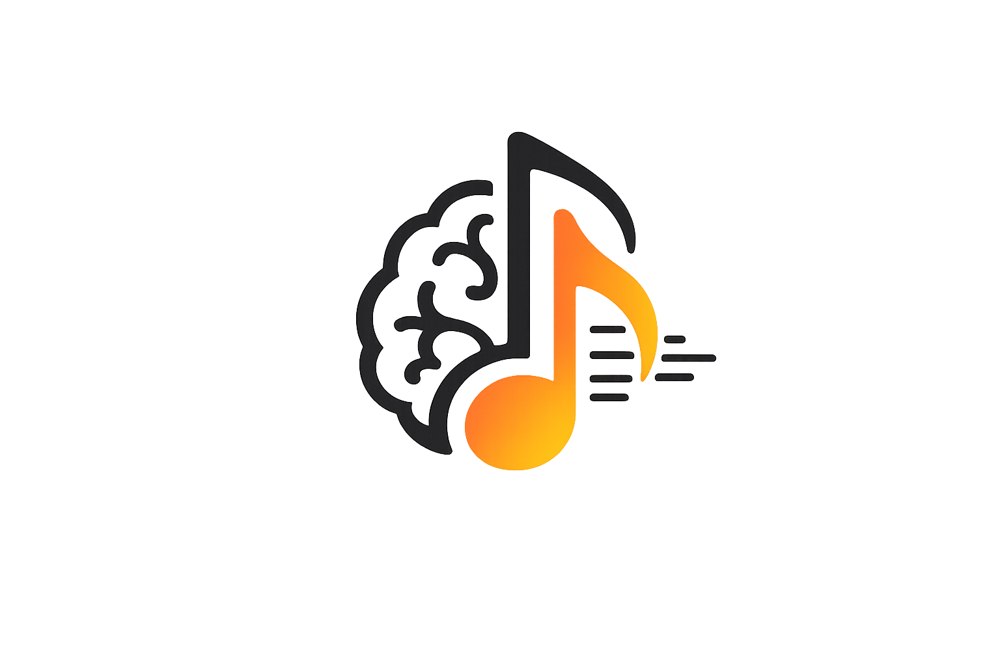
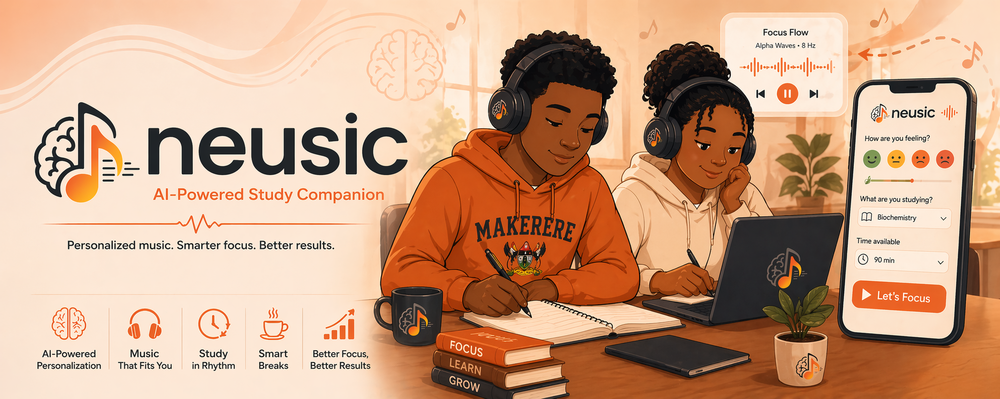
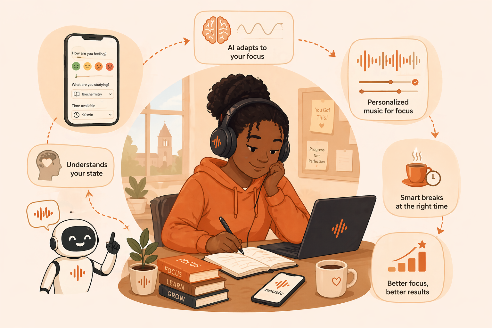
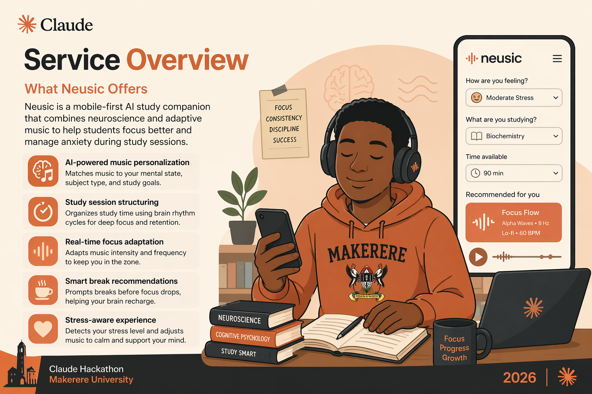

<div align="center">
  

  <h1>Neusic</h1>
  <p><em>Where neuroscience meets music to help students focus and heal.</em></p>
</div>

<p align="center">
  
</p>

---

## What Neusic is

Neusic is a mobile-first AI study companion that combines **auditory entrainment** and **Claude AI** to personalize music sessions to each student's stress level, subject, and available study time — making neuroscience-backed mental wellness accessible to every African university student with a phone.

You tell Neusic where you are. Claude designs the right session for that moment. Music plays in the browser. Engineered binaural beats run underneath. The session adapts in real time as you tell Neusic how you're feeling. At the end, you get a focus score and an insight you can act on.

> **We don't just play music. We engineer your mental state.**

---

## Why this exists

Most students don't need more time — they need the **right mental state**. But the tools that exist are either expensive, generic, or built for meditation rather than studying. Meanwhile, the science is well established:

- The brain naturally synchronizes its neural oscillations to rhythmic auditory stimuli (auditory entrainment).
- Music therapy reduces cortisol levels significantly in university students (*NCBI, 2025*).
- Externally-timed breaks outperform self-regulated breaks (*MDPI, 2025*).

Neusic puts that science into a phone, for free, with no app install.

---

## The three science pillars

### 1. Auditory entrainment

Different frequency targets serve different mental states. Neusic generates these tones in-browser using two oscillators panned hard left and right; the brain perceives the difference between the channels as the entrainment beat (binaural beats).

| Mental state    | Frequency band | Default Hz | Best for                              |
| --------------- | -------------- | ---------- | ------------------------------------- |
| Deep focus      | Beta 12-20 Hz  | 16 Hz      | Mathematics, coding, technical reading |
| Light focus     | Alpha 8-12 Hz  | 10 Hz      | Essays, memorization, recovery        |
| Anxiety relief  | Theta 4-8 Hz   | 6 Hz       | High-stress states before focus       |
| Deep recovery   | Delta 0.5-4 Hz | 2 Hz       | End-of-day decompression              |

### 2. Valence-arousal model

A standard neuroscience framework for mapping emotions to music along two axes — valence (positive ↔ negative) and arousal (energized ↔ calm). Student inputs (stress level + subject difficulty + mood) project onto this plane, and Claude uses the projection to pick the right entrainment band and music profile.

### 3. Cognitive break science

Attention naturally declines after sustained focus. Neusic times breaks to the student's planned focus curve (e.g. `45m focus → 10m break → 35m focus` for a 90-minute session), not a fixed timer. Mid-session feedback can also trigger an early break if the student is fading.

---

## How it works

<p align="center">
  
</p>

```
1. Onboarding         stress slider · subject · duration
        ↓
2. Claude builds your focus profile
        ↓ (band, frequency, tempo, focus blocks, opening message)
3. Session begins     YouTube music + binaural beats underneath
        ↓
4. Mid-session feedback   focused · losing focus · anxious
        ↓ (Claude adapts: lower frequency, trigger break, or reassure)
5. Session summary    focus score + insight + recommendation
```

---

## What's inside Neusic

<p align="center">
  
</p>

- **AI-powered music personalization** — Claude maps your inputs to a valence-arousal profile, picks an entrainment band, and chooses tempo + genre tailored to your subject.
- **Engineered auditory entrainment** — two sine-wave oscillators panned L/R via the Web Audio API generate true binaural beats underneath the music.
- **Structured session timing** — focus blocks and breaks sized to the planned duration, not a fixed Pomodoro.
- **Real-time adaptation** — mid-session feedback retunes the oscillator frequency live, triggers early breaks, or sends a calming check-in.
- **Mobile-first, install-free** — runs in any modern browser. Works on a phone with headphones.

---

## Tech stack

| Layer       | Choice                                            |
| ----------- | ------------------------------------------------- |
| Frontend    | React 18, Vite 6, Tailwind CSS 3                  |
| Backend     | Python 3.10, FastAPI, httpx                       |
| AI          | Anthropic Claude API, model `claude-sonnet-4-6`    |
| Music       | YouTube Data API v3                                |
| Audio       | Web Audio API (in-browser binaural synthesis)     |
| Persistence | None in v1 — sessions are stateless               |

---

## Project structure

```
nuesic/
├── README.md              ← this file
├── assets/                ← pitch slides + logo
├── backend/               ← FastAPI server  (see backend/README.md)
│   ├── main.py            ← API routes
│   ├── claude_service.py  ← Claude integration + system prompt + JSON schemas
│   ├── youtube_service.py ← YouTube Data API v3 search
│   ├── session_logic.py   ← frequency band constants
│   ├── requirements.txt
│   └── .env.example
└── frontend/              ← React app  (see frontend/README.md)
    ├── index.html
    ├── package.json
    ├── tailwind.config.js
    ├── vite.config.js
    └── src/
        ├── App.jsx
        ├── api.js
        ├── pages/
        │   ├── Onboarding.jsx
        │   ├── Session.jsx
        │   └── Summary.jsx
        └── components/
            ├── StressSlider.jsx
            ├── SubjectSelector.jsx
            ├── DurationSelector.jsx
            ├── FocusTimer.jsx
            ├── FeedbackButtons.jsx
            └── EntrainmentLayer.jsx
```

---

## Getting started

### Prerequisites

- Python 3.10+
- Node 18+
- An [Anthropic API key](https://console.anthropic.com)
- A [YouTube Data API v3 key](https://console.cloud.google.com)

### Backend

```bash
cd backend
python3 -m venv .venv && source .venv/bin/activate
pip install -r requirements.txt
cp .env.example .env       # then edit .env with your real keys
uvicorn main:app --reload --port 8000
```

Verify with: `curl http://localhost:8000/health`

### Frontend

```bash
cd frontend
npm install
npm run dev
```

Open <http://localhost:5173>. The Vite dev server proxies `/api/*` to the backend on port 8000.

### Quick smoke test

```bash
curl -X POST http://localhost:8000/api/generate-session \
  -H 'Content-Type: application/json' \
  -d '{"stress_level": 7, "subject": "Biochemistry", "duration_minutes": 90}'
```

You should get back a JSON session profile with `entrainment_target`, `frequency_hz`, `focus_blocks`, an `opening_message`, and a matching YouTube `track`.

---

## API surface

Three endpoints, full schemas documented in [backend/README.md](backend/README.md).

| Method | Path                     | Purpose                                              |
| ------ | ------------------------ | ---------------------------------------------------- |
| POST   | `/api/generate-session`  | Build a session profile from stress + subject + time |
| POST   | `/api/adapt-session`     | Adapt mid-session based on student feedback          |
| POST   | `/api/end-session`       | Compute focus score and generate insight             |

All three call Claude with a shared cached system prompt (entrainment science + JSON schemas) and return strict structured JSON via `output_config.format`.

---

## What makes Neusic different

| Feature                              | Generic music apps | Meditation apps | **Neusic** |
| ------------------------------------ | :----------------: | :-------------: | :--------: |
| Entrainment-based audio              |                    |                 |     ✓      |
| Real-time mental-state adaptation    |                    |                 |     ✓      |
| Built for studying                   |                    |                 |     ✓      |
| African student context              |                    |                 |     ✓      |
| AI-personalized sessions             |                    |                 |     ✓      |
| Mobile-first, install-free           |         ✓          |        ✓        |     ✓      |

---

## Built for

The Claude Hackathon, 2026 · Makerere University.

---

<p align="center"><em>Open Neusic. Tell it where you are. Study better.</em></p>
